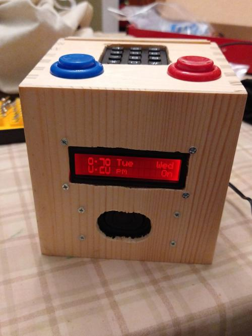
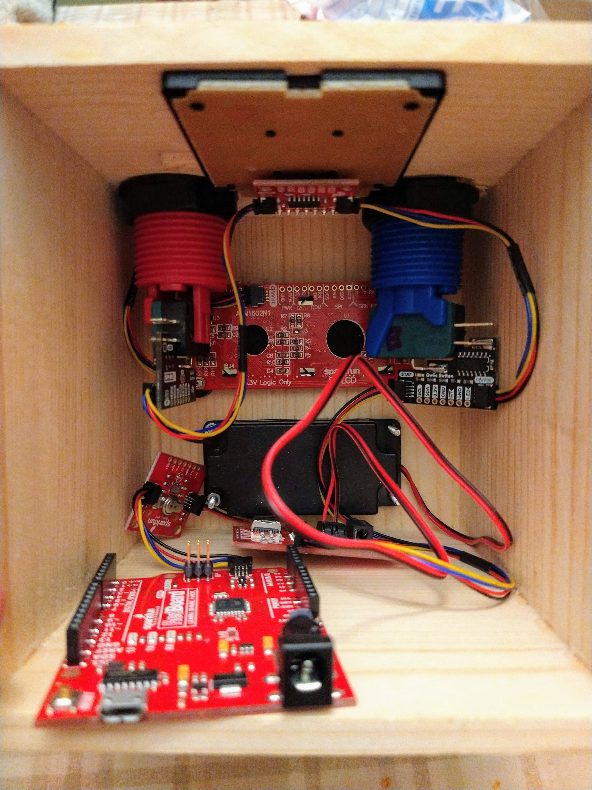
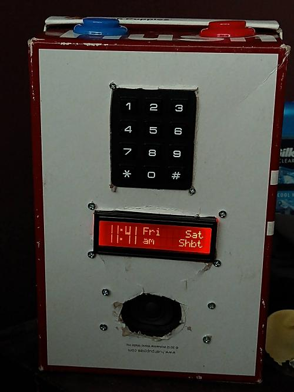

This is a project to create an alarm clock with separate alarm times for each day of the week.
It is inspired by the Neverlate alarm clock by American Innovative, which served me for well
over a decade before its time-setting knob started malfunctioning. As the company is now out
of business, and the alarm clcok cannot be found for sale anymore, I decided to build a
replacement.

# Parts

This alarm clock is intentionally designed to have dead-simple electronics.
Using the SparkFun Qwiic system, assembling the electronics is almost as simple
as buying the components, buying 4-wire Qwiic cables, and plugging the
components into each other in a chain, in any order. I'll discuss a couple of
details below in the assembly instructions.

 * [SparkFun RedBoard Qwiic DEV-15123](https://www.sparkfun.com/products/15123)
 * [SparkFun Real Time Clock Module - RV-1805 (Qwiic) BOB-14558](https://www.sparkfun.com/products/14558)
 * [SparkFun Qwiic MP3 Trigger DEV-15165](https://www.sparkfun.com/products/15165)
 * [SparkFun 16x2 SerLCD - RGB Text (Qwiic) LCD-16397](https://www.sparkfun.com/products/16397)
 * [SparkFun Qwiic Keypad - 12 Button COM-15290](https://www.sparkfun.com/products/15290)
 * 2x SparkFun Qwiic Arcade buttons. I used the following, but you can choose
   other colors. You'll need to change the I2C address of the snooze button to
   110 (0x6E) using
   [Example5_ChangeI2CAddress](https://github.com/sparkfun/SparkFun_Qwiic_Button_Arduino_Library/tree/master/examples/Example5_ChangeI2CAddress).
   * [Red SPX-15591](https://www.sparkfun.com/products/15591) for the stop button.
   * [Blue SPX-15592](https://www.sparkfun.com/products/15592) for the snooze button.
 * A speaker. I used [this one](https://www.amazon.com/gp/product/B0738NLFTG).
 * 6 Qwiic cables.  The [SparkFun Qwiic Cable kit KIT-15081](https://www.sparkfun.com/products/15081) will do nicely.
 * a [power adapter TOL-15314](https://www.sparkfun.com/products/15314)
 * a micro-SD card
 * some sort of enclosure for the final product. I used [this box](https://www.amazon.com/gp/product/B018QLQFR6).

Additionally, you'll need a micro-USB cable to program the RedBoard, and you'll
either need a USB-C cable or a Micro SD card reader to put an MP3 on the Micro
SD card for when your alarm goes off.

# Assembling the electronics

1. Download and install the Arduino IDE from https://www.arduino.cc/en/software
2. Use the library manager within the Arduino IDE to install the following libraries:

   * SparkFun Qwiic Button
   * SparkFun RV1805
   * SparkFun Qwiic MP3 Trigger Arduino Library
   * SparkFun Qwiic Keypad Arduino Library
   * SerLCD

3. Put an MP3 on your SD Card. If you don't have a separate Micro SD card
   reader, you the MP3 Trigger board can act as a Micro SD card reader by
   connecting it to your computer using a USB-C cable. The MP3 needs to be
   named `F001.mp3`.

4. Connect components individually to the RedBoard and run some examples to
   verify that your components work individually.

5. Connect your snooze button to the RedBoard. Open
   `SparkFun_Qwiic_Button_Arduino_Library`'s example
   `Example5_ChangeI2CAddress`. Open the serial monitor in the Arduino IDE. Upload
   the example to your RedBoard. Change the address of this button to `6E`.

6. Upload the `eeprom_clear` example from the `EEPROM` library, and let it run
   until the LED labeled `13` on the RedBoard turns on. This will let your
   alarm clock start for the first time with some sensible default settings.

7. Assemble all of the Qwiic components, in (almost) any order. Note that the
   LCD must go at one end, and the RedBoard must go at the other end, because
   each of those compoenets has only one Qwiic connector.

8. Cut off the connector from the speaker's wire, and strip a bit of insulation
   off the end of the wire. Insert the stripped wires into the two holes of the
   connecter labeled "Speaker" on the MP3 trigger board.

7. Optionally, upload the `Example1_SetTime` example from the `SparkFun RV1085`
   library to set the clock time for the first time. You'll want to keep the
   alarm clock connected to your computer for about the next 10 minutes or so in
   order to charge the supercapacitor that provides backup power to the RTC.

8. Now you're ready to install the Alarm Clock firmware on your RedBoard. Open
   `alarm_clock.ino` in the Arduino IDE, and upload it. Your alarm clock is now
   operational. You'll probably want to build an enclosure for it.

# Enclosure

You can be creative here, according to your skill with woodworking, 3D printing, etc.
I used [this box](https://www.amazon.com/gp/product/B018QLQFR6).

I first prototyped my enclosure by building the alarm clock into a shoe box.
Using the holes in the shoebox, I was able to estimate the sizes of the holes I
would need to cut in my shoe box.

To make a hole for the keypad, I used a 1/4 inch spade bit at each of the
corners, and connected them using a coping saw. It is advised to cut the hole a
little small, and expand it as necessary.

To make holes for the arcade buttons, I used a 1 1/8 inch spade bit.

To make a hole for the dispaly, I used a 1/4 inch spade bit near each of the
corners, because that's the smallest bit I could fit a coping saw through. I
connected the holes using the coping saw, and then used the coping saw to cut
the corners square.

To make a hole for the speaker, I used a 1 inch spade bit. The second hole's
center should go right at the edge of the first hole. In order to ensure that I
didn't lose the center of the second hole before I had a chance to start the
hole, I drilled the two holes in an alternating fashion, drilling a little bit
of the first hole (just enough to make a mark outlining its area), then drilled
the second hole a bit, and then alternated back and forth so that the two holes
were always approximately the same depth. I used my coping saw to straighten
out the edges.

# User manual

The idea behind this project is that we can set the time and alarm using the keypad and a menu system.

The alarm has 4 states:

 * Waiting
   * Hitting the snooze button will immediately set an alarm 8 minutes from now in Snooze mode. (E.g. if you hit the stop button, to stop the alarm, and then changed your mind. Or if you want to take a short impromptu nap, you can hit the snooze button several times.)
   * Hitting the stop button will toggle whether to skip the next alarm. (e.g. if you woke up significantly before your alarm went off, and decided not to go back to sleep.)
 * Snooze
   * Hitting the snooze button will extend the snooze by another 8 minutes.
   * Hitting the stop button will cancel the snooze.
 * Sounding
   * Hitting the snooze button will stop the alarm and start snoozing for 8 minutes.
   * Hitting hte stop button will stop the alarm  and transition to the waiting state for the next day's alarm.
 * The alarm also supports a shabbat mode alarm, which sounds for 30 seconds, cannot be skipped if you wake up early, and all buttons are disabled while it is sounding. For some halachic discussion of the permissibility of setting an alarm on Shabbat, see [this article](http://halachayomit.co.il/en/default.aspx?HalachaID=3914).

## Menu navigation:

The menu navigtaion is as follows:

 * Press any key on the keypad to activate the alarm.
 * Press '2' to move up the menu, and '8' or '0' to move down the menu.
 * Press '5' to select a menu item whose action is to select (primarily setting times.)
 * Press '4' or '6' to cycle through options
   * All alarms enabled/disabled
   * Individual alarm on/off/shabbat
   * Volume control
 * Press '\*' or '#' to exit any menu or input prompt.

# serlcd_charset
`serlcd_charset`, is a demo to get me acquainted with the SerLCD display by showing me which characters it can display.
